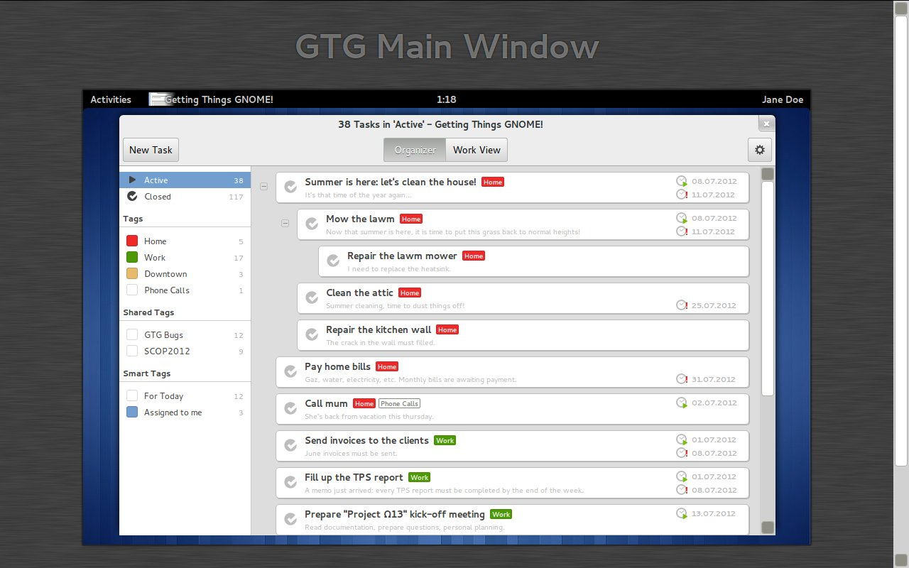
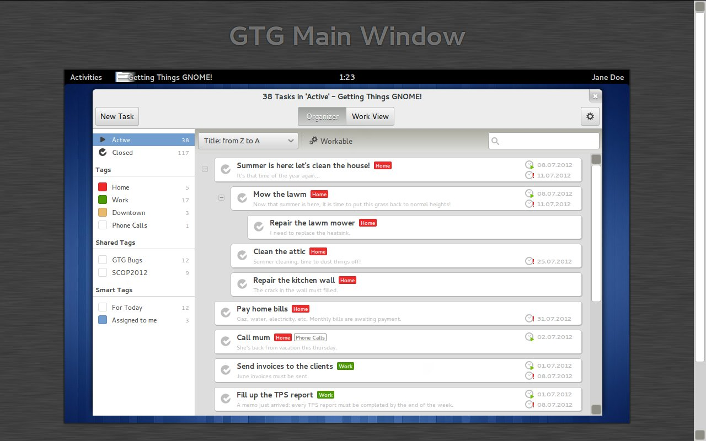
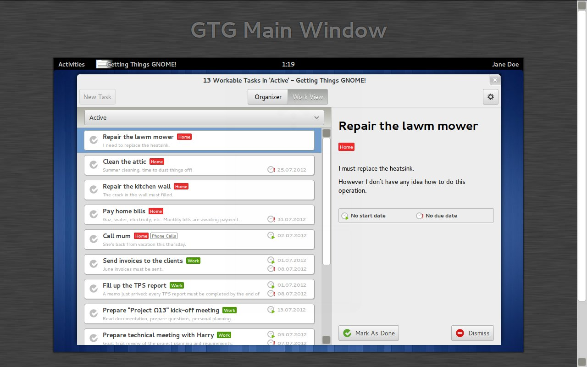
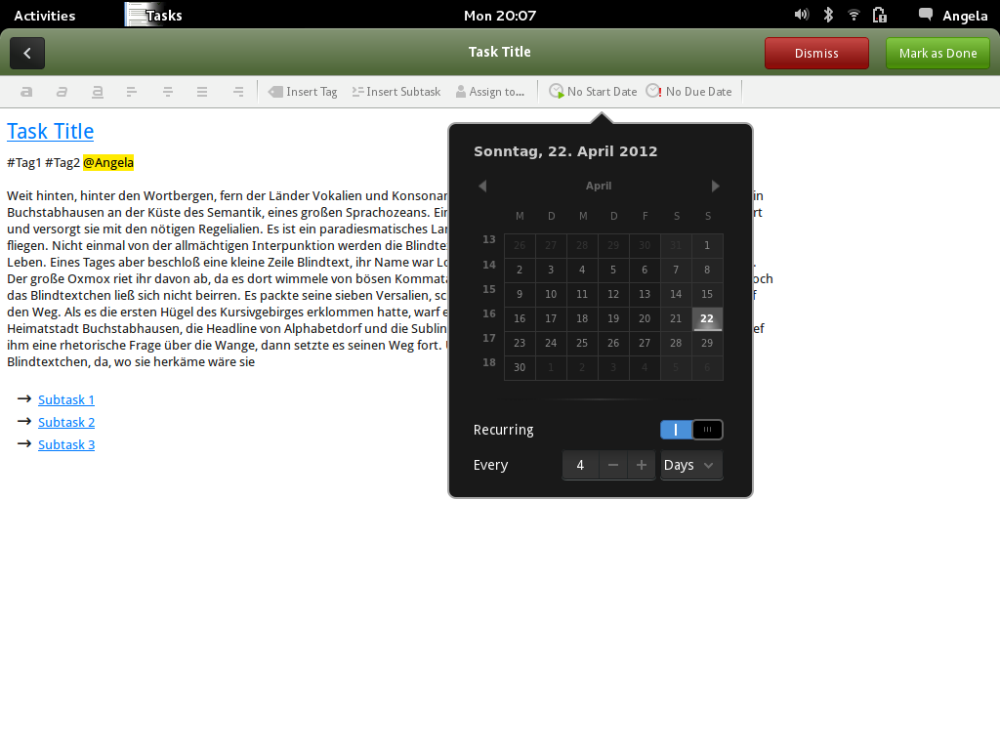

# Design

This page centralizes the works and discussions regarding GTG's UI. Feel
free to post here links and resources related to these aspects. Don't
hesitate to create dedicated subpages as well.

## Current work on GTG's UI

- [Relevant notes regarding GTG's redesign](design_notes)
- [Potential TodoList design](potential_todo_list)
- [Discussion thread on GTG-Contributors](https://lists.launchpad.net/gtg-contributors/msg00756.html)

## Related resources

- [Old mockups and designs](design_old)
- [Related Artwork](design_related_art)

## People interested/currently involved in GTG design efforts

- [BertrandRousseau](https://wiki.gnome.org/BertrandRousseau)
- [IzidorMatusov](https://wiki.gnome.org/IzidorMatusov)
- [alba.](https://wiki.gnome.org/alba.)
- [MegFord](https://wiki.gnome.org/MegFord)
- [AnantGupta](https://wiki.gnome.org/AnantGupta)

------------------------------------------------------------------------

## Requirements

### Whishlist and User Requirements

In this section, we should list the most requested requirements and
features. (See [Launchpad](https://bugs.launchpad.net/gtg))

- Easy synchronization with services like Google Tasks, Remember the Milk etc.
- Permanent Tags (shown in the sidebar although no task is assigned to it)
- Smart Tags a.k.a. saved searches
- Rich text operations in edit mode

### GTGs Goals

See [manifesto](../manifesto)

1. *Relieve stress*

   GTG tries to relieve stress by taking care of everything, it
   makes sure you never forget anything and you never miss a
   deadline.

2. *Focus on what's relevant*

   GTG helps you to focus on the most relevant tasks depending on
   your time, place and deadlines.

3. *Make real progress*

   GTG helps you to know why you need to perform a task so that you
   can make sure that you really progress towards your goals.

4. *Avoid procastination*

   GTG encourages you to do what needs to be done.

### 2. Design Goals

- Comply with the Gnome 3 HIG requirements
- Fluent Inregration with the Gnome 3 desktop
- Accomplish all GTG manifesto goals
- Clean and simple Interface
- Easy syncronisation between GTG and external To-Do Apps.

## Design

### Current Mockups/Wireframes

[Old mockups and designs](design_old)

Latest mockups:

See the related mailing-thread:
<https://lists.launchpad.net/gtg-contributors/msg01119.html>

Previous mockups (by [alba.](https://wiki.gnome.org/alba.)):

(Image went missing: http://img7.imagebanana.com/img/zb46zxpj/gtganim.gif)

## Use Cases

Narrative summary of my experience using gtg. Initial brainstorming that
can be refined as we find use themes and intuitive solutions :)Please
feel free to add to these or disagree with them.

*1. Open gtg for the first time.*  

- Click on "New Task" icon. Title task, close window.  

*Result:* My new task is listed.  
*Verdict:* success!  

*2. Add subtask to my first task.*  

- Right click on task in workview.  

- Add subtask  

- Close window.  

*Expected result:* I will see the task listed in the workview, and I
will either be able to select it and see my new subtask, or it will
appear along with the subtask. *Result:* All I see is the subtask! Did I
accidently erase my task?? *Verdict:* Needs fix. Is there logic behind
this?

*3. Right click on subtask, since I can't find my task anyomore :(*  

- Select edit.
- Type this new entry in my subtask.
- Close.

*Result:* I edited my subtask, and the new text is there the next time I
open my subtask. *Verdict:* Success!

*4. Right click on subtask again, since I still can't find my task.*

- Schedule for -> select schedule for today.

- Result: Start date is now listed as "today".

*Verdict:* Success!

*5. Right click on subtask again.*

- Schedule -> select schedule for tomorrow.

*Expected result:* My choice will be confirmed. *Result:* My subtask
disappeared! *Verdict:* Needs fix.

6\. I go to the top of my window, and click randomly until I discover
that "View" has checkboxes. I uncheck the first one, and there are both
my task and my subtask, in some strange, untitled view . Where am I? All
of the buttons are the same as in workview, but I just unchecked the
workview box, so I guess I'm somewhere new.

7\. Since I have my task back, I right click on it and Schedule for ->
next week. Result: My choice is confirmed. Start date is now listed as
"In 7 days", which is a little different from next week, but close
enough. ...But I'm confused, because to me "In seven days" means it's
due in seven days, not that I start it then. I feel bad because I have
to open my task and use the drop down menu to set my date due. Why can I
set my start date from the overview, but not my due date? And why is
there no indication in the menu that I'm setting start dates and not due
dates? Verdict: I'm really confused now.

8\. Wait, my task is due next month. I right click, Schedule for -> next
month, and wait to see what happens, since "next month" could mean a lot
of different things. Result: My start date is now listed as "04/22". I
click on my calendar to see when that is. Hmmm, it's a Sunday, exactly
30 days from now. What if I want to use this feature in February?
Verdict: Maybe this should be called "30 days".

9\. I right click again, and have the same issue with Schedule for
->next year. When is "Next year"? Result: I find that it is one year
from now. Does this feature work if it's a leap year? Start date is now
listed as 3/23, exactly one year from now. Except, even though my choice
said "NEXT year", my start date lists no year. When I set my date using
the calendar, a year does appear, but only if I am looking ahead two
years, not one. Verdict: I just lost my context
:( And I'm pretty sure this is a bug.

\*\*\*comments: I found that as I chose dates further in the future, my
expectation of what "Schedule for" would mean changed. When I listed a
task and chose "Schedule for -> today" I expected that I would start
that task today. I didn't want to schedule tasks as beginning in a month
or a year, I wanted to set their end dates (because I intuitively
thought "I'm starting this today! Wait, what view am I in? It's still
not labeled!"), or at least be able to set end dates as well as start
dates. Maybe it is just me, but I think about exact dates more when I am
scheduling future events. I may have broad goals that I want to start in
a year, but more often than not I have a doctor's appointment, a
deadline, etc, and having an enticing menu that doesn't deliver makes me
feel frustrated. I think the "Schedule for" menu needs to be re-worked.

\*\*\*first brainstorming solutions: maybe this menu needs to be
different in workview than it is in whatever that second view is. It
could list the choices as "Start today" XOR "Start in the future",
possibly allowing the user to choose a "ballpark" date or pop up the
calendar as a secondary action only if "Start in the future" is chosen.
There should also be some indication that "Start in the future" will
move the task. I also wonder why I am given the choice to schedule an
actionable item for today when I am in a mode (workview) where all
tasks, by context, MUST start today.

## Proposals

Rename to Tasks to be more like the gnome apps: Music, Files, Calendar
...

